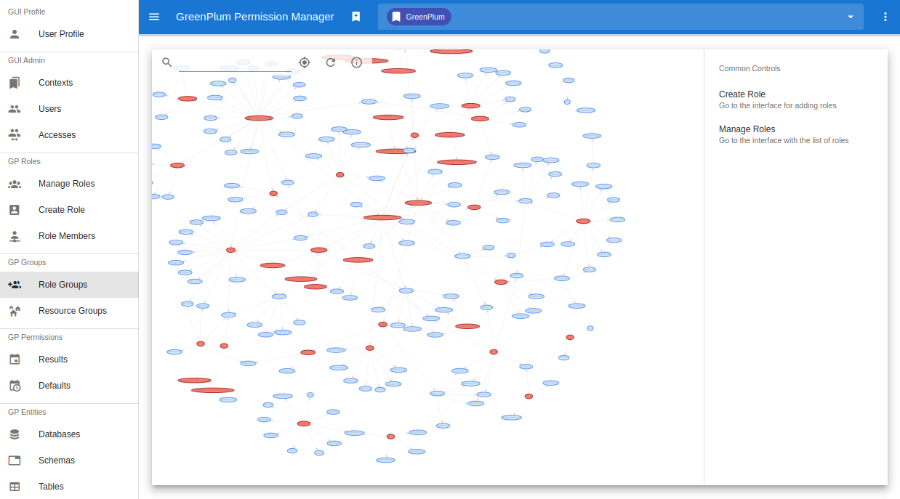

# GreenPlum Permission Manager

WEB-интерфейс управления правами пользователей в [GreenPlum](https://greenplum.org/) и [PostgreSQL](https://www.postgresql.org/).



## Резюме

* [**Функции**](#функции)
* [**Совместимость**](#совместимость)
* [**Быстрый старт**](#быстрый-старт)
* [**Установка**](#установка)
* [**Настройка**](#настройка)
* [**Запуск**](#запуск)
* [**Деплой в K8s**](#деплой-в-k8s)
* [**Разработка**](#разработка)
* [**Лицензия**](#лицензия)

## Функции

Доступные возможности зависят от СУБД. В виду того, что в PostgreSQL отсутствуют ресурсные группы, связанный с ними функционал работать не будет. 

Реализовано для GreenPlum:
- Управление ролями (создание, изменение, удаление)
- Управление группами ролей (добавление, исключение)
- Представление ролей и связей между ними в виде графа и таблицы
- Выдача прав роли (на чтение, редактирования и т. д.): БД, схемы и конкретной таблицы
- Просмотр итоговых прав роли на объект: БД, схему, таблицу
- Просмотр дефолтных прав роли для выбранной базы
- Управление ресурсными группами (создание, изменение, удаление)
- Управление членами ресурсной группы (добавление, исключение)
- Аутентификация пользователя в GUI по email и паролю (поддерживается LDAP)
- Поддержка переключения между несколькими СУБД
- Разграничение прав редактирования СУБД через GUI (до уровня роли, базы, схемы)

## Совместимость

Минимально GreenPlum 6.8 и PostgreSQL 9.6. Будет работать и на более новых версиях.

## Быстрый старт

Для предварительного ознакомления, достаточно воспользоваться подготовленным автономным образом:

```
docker run -it --rm \
    -p 80:80 -p 8080:8080 \
    -v gppm-data:/var/lib/postgresql/9.6 \
    -e SECRET_KEY=HF2IxPeglDZdEVp4702u4mxOpoNcInXnZj80d1Ab \
    -e ENCODING_KEY=SCW2TcT1ko4RaTEXFDXmSsGPIRey0kvNvJz8v0zO73k= \
    ostapkonst/gppm
```

Сервис доступен на `http://localhost`. Данные для входа:

```
login: admin@gppm.com
password: admin
```

Для развертывания на `production`, рекомендуется [собрать](#деплой-в-k8s) backend и frontend образы самостоятельно.

## Установка

Клонируйте репозиторий проекта:

```
git clone https://github.com/dns-technologies/gppm
```

## Настройка

Параметры задаются при помощи переменных окружения, возможные параметры указаны в файле `.env.example` корня проекта. Для тестового запуска, необходимо переименовать `.env.example` в `.env`. Некоторые аргументы должны быть доступны на момент сборки, сперва необходимо настроить их, прежде чем приступать к сборке образов.

### Описание параметров

В поле `Тип`, содержится то, каким образом параметр должен быть передан в Docker: `ENV` — как переменная окружения контейнера, `ARG` — как аргумент сборки образа.

Параметр | Тип | Описание 
--- | --- | ---
SECRET_KEY | ENV | Используется механизмом аутентификации. При изменении секрета, пользователями придется повторно пройти аутентификацию в браузере.
ENCODING_KEY | ENV | Ключ шифрования паролей доступа к СУБД. При изменении секрета, потребуется повторное проставление паролей для всех контекстов.
BACKEND_CORS_ORIGINS | ENV | Список доменов, с которых возможно обращение к API. Для обращения через WEB-интерфейс, его URL следует добавить в этот список.
FIRST_SUPERUSER | ENV | Email первого пользователя с правами администратора.
FIRST_SUPERUSER_PASSWORD | ENV | Пароль `FIRST_SUPERUSER`.
POSTGRES_SERVER | ENV | Расположение PostgreSQL для нужд backend. Рекомендуется версия СУБД не ниже 9.6.
POSTGRES_PORT | ENV | Порт PostgreSQL. Обычно это 5432.
POSTGRES_USER | ENV | Роль для подключения к `POSTGRES_SERVER`.
POSTGRES_PASSWORD | ENV | Пароль `POSTGRES_USER` для подключения к `POSTGRES_SERVER`.
POSTGRES_DB | ENV | База на `POSTGRES_SERVER`, в которой должны быть права на выполнение DDL и DML команд от роли `POSTGRES_USER`.
LOGGING_DEBUG | ENV | Флаг логирования сообщений об ошибках. Сообщения содержат текст ошибки и HTTP-код ответа. 
INSTALL_DBLINK | ENV | Установка `dblink` при его отсутствии. Позволяет использовать более сложный алгоритм удаления ролей.
GRANT_WITH_ADMIN_OPTION | ENV | Объединение ролей с `WITH ADMIN OPTION`. Роль сможет добавлять членов в группу, которой принадлежит.
DEEP_REVOKE | ENV | Выполнять `REVOKE` от всех ролей, которые выдали права.
AUTH_PROVIDER | ENV | Тип аутентификации: `local` или `ldap`. При выборе `ldap`, применятся настройки с префиксом `LDAP_`.
AUTH_OPEN_REGISTRATION | ENV | Проверка пароля при первой аутентификации. Позволяет проще регистрировать новых пользователей.
AUTH_REFRESH_PASSWORD | ENV | Перезаписывать пароль при каждой аутентификации. Рекомендуется включить для `ldap`.
LDAP_HOST | ENV | Расположение LDAP сервера.
LDAP_USER_SEARCH_BASE| ENV | Базовый DN, используемый для поиска пользователей.
LDAP_USER_SEARCH_FILTER | ENV | Выражение фильтра, используемое для поиска пользователей. Используйте `{email}` там, где ожидается совпадение с почтой пользователя.
LDAP_USER_ATTRS | ENV | Список атрибутов, которые будут использованы в качестве имени пользователя.
FRONTEND_DOMAIN | ARG | Базовая часть URL API, к которой будут посылаться запросы из GUI. Задается при сборке fronted-образа.

## Запуск

Достаточно собрать контейнеры командой `docker-compose build` из корня проекта. На этом шаге будут скачаны базовые образы, выполнены команды установки зависимостей для backend и frontend и прочие команды из `backend/backend.dockerfile` и `frontend/fontend.dockerfile`. После успешной сборки, выполнить `docker-compose up`. Запущенный сервис доступен на `http://localhost`.

## Деплой в K8s

Деплой в [K8s](https://kubernetes.io/) кластер осуществляется с помощью [Helm-чартов](https://helm.sh/) из директории `charts/gppm`. Настройка производится редактированием файла `charts/gppm/values.yaml`. Предварительно, требуется собрать образы и [опубликовать](https://docs.docker.com/docker-hub/#step-5-build-and-push-a-container-image-to-docker-hub-from-your-computer) их в Container Registry. В качестве HTTP-сервера на backend по умолчанию используется [Gunicorn](https://gunicorn.org/). В среде разработки по умолчанию запускается [Uvicorn](https://www.uvicorn.org/).

Команды сборки контейнеров:

```
cd backend
docker build \
    -t gppm-backend \
    -f backend.dockerfile \
    --no-cache .
```

```
cd frontend
docker build \
    -t gppm-frontend \
    -f frontend.dockerfile \
    --build-arg FRONTEND_DOMAIN=gppm.com \
    --no-cache .
```

## Разработка

Проект состоит из backend и frontend частей. Backend — RestFull API на [FastAPI](https://fastapi.tiangolo.com/) с использованием [ORM SQLAlchemy](https://www.sqlalchemy.org/) и [СУБД PostgreSQL](https://www.postgresql.org/) для хранения параметров аутентификации/авторизации доступа к WEB-интерфейсу. Frontend — SPA приложение на стеке [Vue.js](https://vuejs.org/) + [Vuex](https://vuex.vuejs.org/) + [Vuetify](https://vuetifyjs.com/) с использованием JavaScript и TypeScript библиотек.

Для разработки, сервисы нужно запускать отдельно. Миграция БД производится библиотекой [Alembic](https://alembic.sqlalchemy.org/) автоматически при старте. Для frontend разработки, требуется установленный [Node.js](https://nodejs.org/) версии не ниже `v14.x` (рекомендуется `v16.x`). Для backend разработки, требуется установленный [Docker Compose](https://docs.docker.com/compose/).

### Backend с Live Reloading

При изменении кода backend, сервер перезапустится автоматически:

```
docker-compose up --build
```

### Frontend с Hot Reloading

При изменении кода frontend, изменения применятся автоматически:

```
cd frontend
npm install
npm run serve
```

### Доступ к Dev окружению

По умолчанию, после выполнения описанных выше команд:
- GUI: http://localhost:8080
- API: http://localhost/docs

### Генерация Alembic миграций

Для генерации миграций из контейнера, выполнить:

```
docker-compose run backend bash
alembic revision --autogenerate -m "Migration title"
```

### Тестирование

Вместе с приложением, можно поднимать контейнеры с GreenPlum 6.8 и PostgreSQL 9.6. Логины и пароли тестового окружения находятся в `docker-compose.stage.yml`. Команда запуска:

```
docker-compose \
    -f docker-compose.yml \
    -f docker-compose.stage.yml \
    up --build
```

## Лицензия

```
The MIT License (MIT)

Copyright (c) 2022 ООО "ДНС Технологии"

Permission is hereby granted, free of charge, to any person obtaining a copy
of this software and associated documentation files (the "Software"), to deal
in the Software without restriction, including without limitation the rights
to use, copy, modify, merge, publish, distribute, sublicense, and/or sell
copies of the Software, and to permit persons to whom the Software is
furnished to do so, subject to the following conditions:

The above copyright notice and this permission notice shall be included in all
copies or substantial portions of the Software.

THE SOFTWARE IS PROVIDED "AS IS", WITHOUT WARRANTY OF ANY KIND, EXPRESS OR
IMPLIED, INCLUDING BUT NOT LIMITED TO THE WARRANTIES OF MERCHANTABILITY,
FITNESS FOR A PARTICULAR PURPOSE AND NONINFRINGEMENT. IN NO EVENT SHALL THE
AUTHORS OR COPYRIGHT HOLDERS BE LIABLE FOR ANY CLAIM, DAMAGES OR OTHER
LIABILITY, WHETHER IN AN ACTION OF CONTRACT, TORT OR OTHERWISE, ARISING FROM,
OUT OF OR IN CONNECTION WITH THE SOFTWARE OR THE USE OR OTHER DEALINGS IN THE
SOFTWARE.
```
